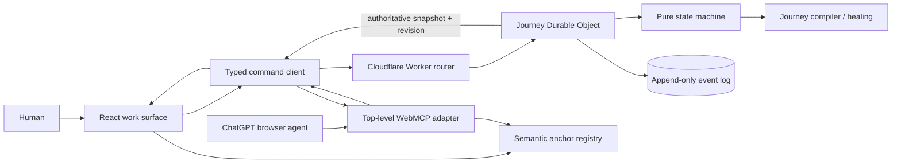

# pave.to(done) — Engineering Specification

**Status:** Hackathon production-grade vertical slice  
**Architecture:** top-level WebMCP client + Cloudflare Worker + one Durable Object per guest journey  
**Primary quality goal:** make every human and agent action safe to retry, observable, recoverable, and derived from one authoritative state machine

> **Implementation audit — September 1, 2026:** ~~Struck-through items~~ ✅ have direct implementation or test evidence. Unstruck specification remains incomplete, partially implemented, or not yet verified. Combined requirements remain unstruck when any clause is still open.

## 1. Engineering thesis

The difficult part of `pave.to(done)` is not registering many tools. It is maintaining a correct shared task while a probabilistic agent, a person, the UI, and a changing application can all produce state transitions.

The submission therefore implements five substantial systems:

1. a versioned semantic capability registry;
2. a policy-enforced journey state machine;
3. a serialized, idempotent command service with an append-only event log;
4. a compiler that reconciles a recorded or on-demand journey with the current capability version; and
5. a route- and state-scoped WebMCP adapter with cancellation, redaction, and recovery.

The browser remains the collaboration surface. Server state provides durability and correctness; it does not replace WebMCP with a backend MCP integration.

## 2. System context



### Trust boundaries

- **Agent input:** all WebMCP arguments are untrusted.
- **Application content:** receipt notes, recording narration, and user text are untrusted content even when returned by a read tool.
- **Browser state:** useful for presentation, never authoritative for commands.
- **Worker/DO state:** authoritative for journey state, policy, idempotency, and audit history.
- **Human-only controls:** enforced by omission from the WebMCP surface, server state, one-time confirmation challenges, and transient user-activation checks. This prevents completion through the submitted WebMCP path; it is not claimed as a defense against a user who runs arbitrary JavaScript in their own browser.

## 3. Runtime and deployment

### Selected runtime

- ~~React + TypeScript + Vite.~~ ✅
- ~~Cloudflare Vite plugin and Worker runtime.~~ ✅
- ~~Cloudflare Durable Objects for one serialized journey coordinator per guest session.~~ ✅
- ~~Durable Object storage for snapshot, idempotency records, and event log.~~ ✅
- Zod as the source for runtime contracts; checked JSON Schema generated for WebMCP.
- CSS/SVG for interface motion, including the three signature effects; no runtime animation dependency is required for the two-route submission build.
- Vitest, Testing Library, fast-check, and Playwright.

### Why Durable Objects

Human UI requests and agent tool calls may overlap, repeat, arrive after stale reads, or be canceled after the server committed. A Durable Object provides one ordered coordinator for a journey and durable transactional storage. This lets the implementation demonstrate concurrency control rather than hoping browser-local updates arrive in a safe order.

### Deployment headers

The Worker sets:

```text
Origin-Agent-Cluster: ?1
Permissions-Policy: tools=(self), microphone=(self)
Content-Security-Policy: default-src 'self'; script-src 'self'; style-src 'self' 'unsafe-inline'; img-src 'self' data:; connect-src 'self'; object-src 'none'; base-uri 'none'; frame-ancestors 'none'
Referrer-Policy: no-referrer
X-Content-Type-Options: nosniff
```

`style-src 'unsafe-inline'` may be narrowed if the final animation library does not require it. WebMCP availability and `window.originAgentCluster` are checked in the live diagnostics. Tools are registered only at the top-level `/demo` route because ChatGPT does not currently discover iframe or declarative tools.

## 4. Authoritative domain model

### Journey snapshot

```ts
interface JourneySnapshot {
  sessionId: string;
  revision: number;
  portalVersion: "expense.v1" | "expense.v2";
  capabilityManifestVersion: string;
  source:
    | { kind: "recorded"; guideId: string; guideVersion: number }
    | { kind: "on-demand"; goal: string };
  agencyMode: "show" | "with" | "for";
  status:
    | "idle"
    | "planning"
    | "active"
    | "awaiting_user"
    | "awaiting_confirmation"
    | "repair_required"
    | "completed"
    | "blocked";
  steps: JourneyStep[];
  expense: ExpenseProjection;
  pendingRepair?: RepairProposal;
  pendingConfirmation?: ConfirmationSummary;
  recording?: RecordingProjection;
  lastEventHash: string;
  updatedAt: string;
}
```

### Capability manifest

```ts
interface CapabilityDefinition<Input> {
  id: CapabilityId;
  version: string;
  title: string;
  inputSchema: ZodType<Input>;
  risk: "read" | "reversible" | "sensitive";
  allowedActors: readonly ("human" | "agent")[];
  preconditions: Predicate[];
  postconditions: Predicate[];
  anchorKey?: AnchorKey;
  aliases?: string[];
}
```

A guide references a capability ID and semantic inputs. It never stores a selector, screen coordinate, React component name, or imperative click script.

### Commands and events

Commands express intent and may fail. Events record accepted facts.

```ts
type JourneyCommand =
  | StartJourney
  | ChangeAgencyMode
  | ShowGuidance
  | CreateExpenseDraft
  | UpdateExpenseDraft
  | PrepareExpenseSubmission
  | ConfirmExpenseSubmission
  | ChangePortalVersion
  | ProposeRepair
  | ApproveRepair
  | StartRecording
  | StopRecording
  | SaveGuideDraft
  | PublishGuide
  | ResetSession;

interface CommandEnvelope<C extends JourneyCommand> {
  operationId: string;
  expectedRevision: number;
  actor: { kind: "human" | "agent"; surface: "ui" | "webmcp" };
  command: C;
  sentAt: string;
}

interface DomainEvent {
  eventId: string;
  sessionId: string;
  revision: number;
  operationId: string;
  type: string;
  actor: CommandEnvelope<JourneyCommand>["actor"];
  safePayload: unknown;
  previousHash: string;
  eventHash: string;
  occurredAt: string;
}
```

The transition engine is a pure function:

```ts
decide(snapshot, commandEnvelope, manifest):
  | { ok: true; events: DomainEventDraft[] }
  | { ok: false; error: DomainError };

evolve(snapshot, event): JourneySnapshot;
```

This split makes replay, invariants, and failure cases deterministic.

## 5. Command protocol

### API

```text
POST /api/sessions
GET  /api/sessions/:sessionId
POST /api/sessions/:sessionId/commands
GET  /api/sessions/:sessionId/events?afterRevision=N&limit=50
POST /api/sessions/:sessionId/reset
GET  /api/health
```

Each guest receives a cryptographically random session ID. No PII or real expense data is required. State expires after seven days through a Durable Object alarm; reset is always available.

### Command execution

For every command, the Durable Object:

1. validates request size, content type, origin, and schema;
2. ~~rate-limits the session;~~ ✅
3. ~~looks up `operationId`;~~ ✅
4. ~~returns the original result if the operation already committed;~~ ✅
5. ~~compares `expectedRevision` to the authoritative revision;~~ ✅
6. ~~revalidates actor, agency mode, current step, risk, preconditions, and portal version;~~ ✅
7. ~~runs the pure `decide` function;~~ ✅
8. ~~appends events and updates the snapshot in one storage transaction;~~ ✅
9. ~~stores the idempotent result;~~ ✅
10. ~~returns the new snapshot projection and next control boundary.~~ ✅

### Concurrency and stale state

- ~~Each accepted command increments the revision exactly once.~~ ✅
- ~~Two commands using the same prior revision cannot both mutate the journey.~~ ✅
- ~~A stale command receives `STALE_REVISION` with the current revision and a bounded state summary.~~ ✅
- ~~The client refreshes and re-evaluates; it never blindly resubmits a mutation under a new revision.~~ ✅
- ~~Repeating the same `operationId` returns the original result and creates no second event.~~ ✅

### Cancellation and ambiguous outcomes

WebMCP `execute` receives an `AbortSignal`, which is passed to fetch. The operation ID is saved before the request begins.

- ~~If canceled before dispatch, no command is sent.~~ ✅
- ~~If the server returns a result, the client clears the pending operation.~~ ✅
- ~~If cancellation or network failure occurs after dispatch, the UI reports **Outcome unknown—reconciling**.~~ ✅
- The next state read checks the operation record/event log before allowing a retry.
- ~~A mutation is never labeled failed and automatically repeated when it may have committed.~~ ✅

## 6. Policy and human control

### ~~Policy table~~ ✅

| Capability risk     | SHOW ME       | DO IT WITH ME                    | DO IT FOR ME                         |
| ------------------- | ------------- | -------------------------------- | ------------------------------------ |
| Read                | agent allowed | agent allowed                    | agent allowed                        |
| Visual guidance     | agent allowed | agent allowed                    | agent allowed                        |
| Reversible mutation | agent denied  | only current agent-assigned step | agent allowed for current valid step |
| Sensitive effect    | agent denied  | agent denied                     | agent denied                         |
| Repair approval     | human only    | human only                       | human only                           |
| Guide publication   | human only    | human only                       | human only                           |

The policy is enforced in the state machine, not only by hiding controls or omitting tools.

### ~~Human confirmation ceremony~~ ✅

`prepare_expense_submission` creates a server-side pending confirmation containing a one-time challenge and an expiry. The WebMCP result returns the visible summary but not a finalization tool.

The confirmation button:

1. ~~verifies a real transient `navigator.userActivation.isActive` state;~~ ✅
2. ~~displays amount, receipt, category, project, and consequence;~~ ✅
3. ~~sends `ConfirmExpenseSubmission` from the UI surface with the challenge;~~ ✅
4. ~~invalidates the challenge after one use or expiry.~~ ✅

This produces a defensible human-control boundary for the WebMCP workflow without claiming protection against arbitrary local script execution.

## 7. Journey compiler and self-healing

### Inputs

- guide definition or agent-proposed on-demand plan;
- source capability-manifest version;
- current capability manifest;
- authoritative journey snapshot; and
- active agency policy.

### Compile process

1. Validate that every step references a known semantic capability.
2. Validate inputs against the capability's current schema.
3. Evaluate each step's postconditions against current state; mark already satisfied steps complete.
4. Compare source and current risk. Any risk increase is material and blocks automatic continuation.
5. Compare required inputs and preconditions.
6. Resolve unchanged capabilities to current anchor keys.
7. Emit one of:
   - `compatible`: no change;
   - `remapped`: presentation or ordering changed safely;
   - `repair_required`: a material input/precondition changed;
   - `blocked`: capability removed, risk increased, or meaning is ambiguous.
8. Reassign incomplete step actors from the active agency mode without changing authority.

### Repair proposal constraints

An agent may propose a repair, but the server rejects a proposal that:

- references an unknown capability;
- removes an unsatisfied required postcondition;
- lowers the current capability risk;
- converts a human-only step to an agent step;
- modifies completed events;
- skips a pending confirmation; or
- targets a different session/version than the current snapshot.

Approval writes a `RepairApproved` event; the compiler then rebuilds only the remaining projection.

### ~~Tamper-evident history~~ ✅

Each event hash covers a canonical serialization of the previous hash, revision, actor, event type, safe payload, and timestamp. On replay, the server verifies the chain before trusting the projection. The UI exposes the chain status as **History verified**, not the raw hashes by default.

## 8. Recording architecture

Recording begins only after an explicit human UI action. It captures accepted domain events and optional narration. It does not record the screen, DOM, raw pointer movement, keystrokes, credentials, or sensitive values.

The recording projection includes:

- ordered capability IDs;
- redacted semantic inputs;
- pre/postcondition observations;
- actor and risk;
- portal/manifest version; and
- bounded narration marked as untrusted content.

`get_recording_trace` returns a bounded redacted trace. `save_guide_draft` accepts an agent-authored guide whose steps are revalidated against the trace and manifest. Only a human UI command can publish it. A published guide is immutable; repair creates a new version.

## 9. WebMCP adapter

### ~~Tool groups~~ ✅

Tools are exposed according to current route and state. Dynamic registration reduces ambiguity, while the server remains the final authorization boundary.

**Always available on `/demo`:**

- ~~`get_app_context`~~ ✅
- ~~`list_capabilities`~~ ✅
- ~~`list_guides`~~ ✅
- ~~`get_journey`~~ ✅
- ~~`set_agency_mode`~~ ✅

**Journey planning:**

- ~~`create_journey`~~ ✅

**Current-step tools, registered only when applicable:**

- ~~`show_guidance`~~ ✅
- ~~`create_expense_draft`~~ ✅
- ~~`update_expense_draft`~~ ✅
- ~~`prepare_expense_submission`~~ ✅
- ~~`propose_journey_repair`~~ ✅

**Recording review:**

- ~~`get_recording_trace`~~ ✅
- ~~`save_guide_draft`~~ ✅

Sensitive confirmation, repair approval, recording start, and guide publication are never registered.

### Lifecycle

- ~~One `AbortController` owns route-level tools.~~ ✅
- ~~A separate controller owns state-scoped tools and is replaced when availability changes.~~ ✅
- ~~Registration errors are captured and surfaced as diagnostics.~~ ✅
- ~~Component teardown and route navigation abort registration.~~ ✅
- ~~Tool execution uses the callback's signal for request cancellation.~~ ✅
- Strict Mode remount tests prove there are no duplicate registrations.
- ~~Tool names and schemas remain stable within a capability-manifest version.~~ ✅

### Schema discipline

- Zod definitions generate JSON Schema to avoid drift.
- ~~Server parses the same logical contract independently; exposed schema is never treated as a security boundary.~~ ✅
- ~~Objects reject additional properties.~~ ✅
- Strings, arrays, amounts, and event lists are bounded.
- ~~Tools never accept selectors, URLs, HTML, code, generic action names, or arbitrary key/value input.~~ ✅

### Result envelope

```ts
interface ToolResult {
  content: Array<{ type: "text"; text: string }>;
  structuredContent?: {
    status: "ok" | "needs_human" | "refresh" | "blocked";
    revision: number;
    summary: string;
    changed?: string[];
    next?: { actor: "human" | "agent"; capabilityId?: string };
    error?: { code: DomainErrorCode; retryable: boolean };
  };
}
```

The text and structured result agree. Normal output stays under 1.5 KB. Raw upstream errors, stack traces, session identifiers, challenges, event hashes, and hidden state are never returned to the agent.

### Error taxonomy

| Code                  | Meaning                                    | Retry policy                                   |
| --------------------- | ------------------------------------------ | ---------------------------------------------- |
| `INVALID_INPUT`       | Schema or semantic validation failed       | Do not retry unchanged.                        |
| `STALE_REVISION`      | Another accepted action changed state      | Read state and reconsider.                     |
| `POLICY_DENIED`       | Actor/mode cannot perform action           | Do not retry; return control.                  |
| `PRECONDITION_FAILED` | Required state is missing                  | Read state; satisfy requirement.               |
| `REPAIR_REQUIRED`     | Current guide is incompatible              | Propose/display repair.                        |
| `AWAITING_HUMAN`      | Confirmation or approval is pending        | Stop agent mutation.                           |
| `NOT_FOUND`           | Capability/resource no longer exists       | Block or replan.                               |
| `RATE_LIMITED`        | Session command budget exceeded            | Retry after indicated delay.                   |
| `CANCELED`            | Execution was canceled before known commit | Reconcile state.                               |
| `AMBIGUOUS_OUTCOME`   | Commit may have occurred                   | Never retry blindly; reconcile operation.      |
| `INTERNAL`            | Unexpected server failure                  | Read state; report without exposing internals. |

## 10. Client state and UX correctness

- ~~The UI renders an authoritative snapshot and its revision.~~ ✅
- Commands enter a pending state; double submission is disabled.
- ~~No speculative success is shown before server acknowledgement.~~ ✅
- ~~On `STALE_REVISION`, the client refreshes and explains what changed.~~ ✅
- ~~`BroadcastChannel` shares accepted snapshots between same-origin tabs for the same guest session.~~ ✅
- ~~Reconnect loads snapshot plus events after the last known revision.~~ ✅
- ~~The action trail renders accepted server events, not local click logs.~~ ✅
- ~~Guidance position is client presentation state; journey progress is server state.~~ ✅
- ~~`ResizeObserver`, scroll listeners, and semantic React refs keep the visual anchor current.~~ ✅
- ~~A focused, visible-tab orchestrator submits `ShowGuidance` exactly once when control reaches a person and no matching guidance exists.~~ ✅
- ~~Human-owned portal controls remain disabled until that guidance revision commits, preventing a guidance/action stale-revision race.~~ ✅
- ~~Real inputs commit on Enter/blur, selects commit on change, and preparation uses the portal review control; accepted server state alone advances the UI.~~ ✅
- ~~Automatic speech is keyed by session, step, and resolved anchor so rerenders cannot repeat it.~~ ✅
- ~~Journey help parses only bounded semantic intents locally; raw transcripts are not sent to persistence. Point-on-demand is transient presentation state and cannot advance progress.~~ ✅
- ~~Background tabs neither initiate automatic guidance nor speak. Focus and visibility events safely wake an unguided human step.~~ ✅

## 11. Observability

### Structured server logs

Each request emits:

```json
{
  "requestId": "...",
  "operationId": "...",
  "sessionHash": "...",
  "command": "UpdateExpenseDraft",
  "actor": "agent:webmcp",
  "fromRevision": 7,
  "toRevision": 8,
  "outcome": "accepted",
  "durationMs": 12
}
```

Logs exclude expense narrative, receipt text, confirmation challenge, and full session ID.

### Live diagnostic panel

The submitted page shows:

- WebMCP support and top-level registration;
- origin-isolation and permissions status;
- registered/state-scoped tool names;
- current manifest version and journey revision;
- last invocation duration and outcome;
- pending/reconciled operation state; and
- event-chain verification.

This makes engineering visible to judges without turning the product into a developer console.

## 12. Security controls

- ~~same-origin tools only; no `exposedTo` cross-origin list;~~ ✅
- ~~`Permissions-Policy: tools=(self)`;~~ ✅
- ~~exact `Origin` checks on mutating API requests;~~ ✅
- ~~cryptographically random guest session IDs and bounded seven-day retention;~~ ✅
- ~~rate and request-size limits;~~ ✅
- ~~client and server schema validation;~~ ✅
- ~~React text rendering only; no `dangerouslySetInnerHTML`;~~ ✅
- ~~`untrustedContentHint` on receipts and recording traces;~~ ✅
- ~~`readOnlyHint` on all read tools;~~ ✅
- ~~sensitive actions omitted from tools and guarded by human activation/challenge;~~ ✅
- ~~server policy enforcement independent of visible controls;~~ ✅
- ~~CSP and secure response headers;~~ ✅
- sanitized/redacted logs and outputs;
- ~~no secrets, personal accounts, external URLs, or real financial operations in the demo.~~ ✅

Threats explicitly tested: prompt injection in receipt notes, duplicate calls, stale calls, out-of-order calls, mode escalation, repair risk downgrade, replayed confirmation, cross-session access, oversized strings, cancellation after dispatch, and route navigation while a tool is active.

## 13. Test strategy

### Unit tests

- every command transition and rejection;
- capability manifest compatibility rules;
- guide compiler outcomes;
- ~~event hashing and replay;~~ ✅
- redaction and bounded result formatting;
- tool schema generation and annotations.

### Property-based invariants

Generate random valid/invalid command sequences and verify:

1. revisions are strictly monotonic;
2. one operation ID produces at most one state change;
3. agent commands never produce a sensitive event;
4. an unapproved repair never resumes the journey;
5. completed facts do not disappear except through explicit reset;
6. replayed events always reproduce the stored snapshot;
7. event hashes verify or the session blocks;
8. a portal migration never lowers risk or expands allowed actors.

### Concurrency/fault tests

- same operation sent twice concurrently;
- two different commands with the same expected revision;
- request aborted before dispatch;
- response lost after commit;
- Worker retry/reload;
- browser refresh while approval is pending;
- route unmount while WebMCP execution is active.

### Contract tests

- JSON Schema is accepted by the browser and rejects unknown properties;
- client and server accept/reject the same fixture corpus;
- output budgets and redaction hold for worst-case data;
- dynamic registration matches state and cleans up without duplicates.

### Agent evals

- direct, ambiguous, adversarial, and mode-conflicting prompts;
- correct tool selection from the complete state-specific tool list;
- correct arguments;
- correct multi-tool sequencing;
- recovery after stale state or a failed mid-chain capability;
- correct stop at repair or confirmation.

### End-to-end

- all three modes;
- recorded and on-demand sources;
- cosmetic and material portal migrations;
- mode changes mid-journey;
- ~~WebMCP unsupported fallback;~~ ✅
- ~~keyboard, reduced motion, and responsive layout;~~ ✅
- deployed ChatGPT browser and Chrome DevTools WebMCP panel.

## 14. CI and release quality gates

GitHub Actions runs on every push:

```text
npm run format:check
npm run lint
npm run typecheck
npm run test:unit
npm run test:property
npm run test:contract
npm run build
npm run test:e2e
```

The release gate also requires:

- three clean-reset demo passes;
- zero production console errors;
- WebMCP lifecycle trace in Chrome DevTools;
- prompt-eval results recorded with browser/model/date;
- Lighthouse desktop performance and accessibility at 90+;
- CSP/header verification;
- logged-out live URL, repository, license, and video verification.

## 15. Deliberate production limitations

The submission demonstrates production engineering patterns but is not presented as a production expense system. It uses guest sessions, fictional data, one application domain, and a seven-day retention policy. A real deployment would add authenticated principals, organization RBAC, encrypted durable user data, audited administrative policy, global guide storage, privacy review, regional retention controls, and formal incident response. These are documented boundaries, not hidden gaps.

## 16. Primary technical sources

- [WebMCP specification and explainer](https://github.com/webmachinelearning/webmcp)
- [WebMCP specification draft](https://webmachinelearning.github.io/webmcp/)
- [OpenAI Site Tools guidance](https://learn.chatgpt.com/docs/webmcp)
- [Chrome WebMCP implementation guide](https://developer.chrome.com/docs/ai/webmcp)
- [Chrome WebMCP security guidance](https://developer.chrome.com/docs/ai/webmcp/secure-tools)
- [Chrome WebMCP evaluation guidance](https://developer.chrome.com/docs/ai/webmcp/evals)
- [Chrome DevTools WebMCP panel](https://developer.chrome.com/docs/devtools/application/webmcp)
- [Cloudflare WebMCP React starter](https://github.com/cloudflare/agents/tree/main/examples/webmcp-react)
- [Vercel production storefront WebMCP implementation](https://github.com/vercel/shop/pull/498)
