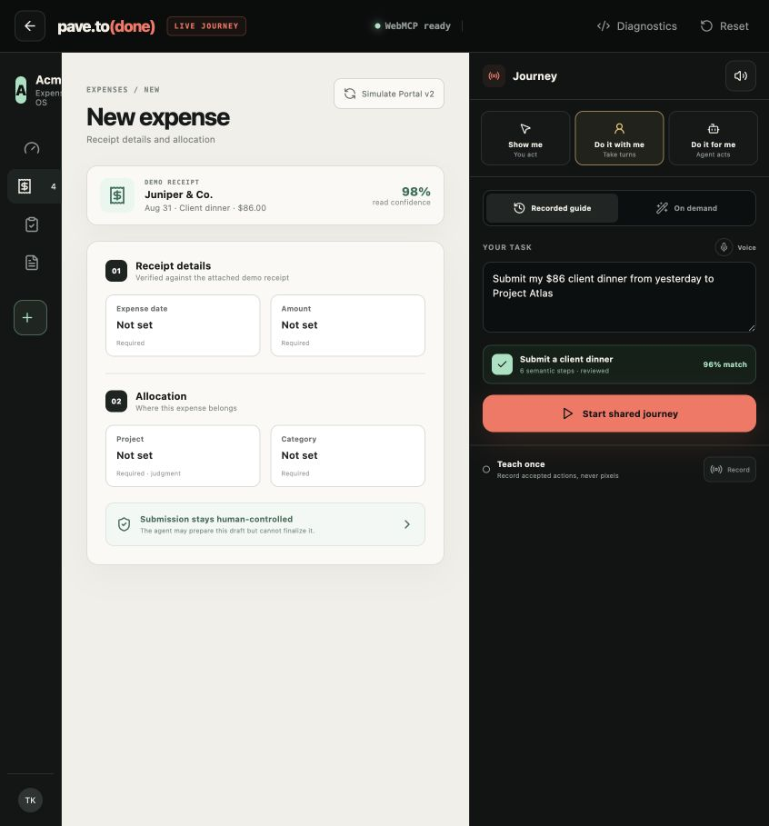
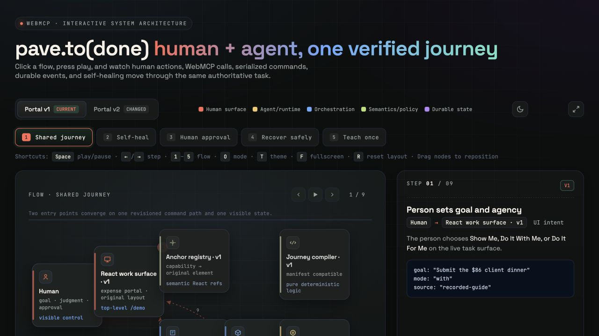

<div align="center">

# pave.to(done)

### Teach once. Assist at any level. Stay correct as software changes.

[](https://github.com/Tanya-Khanna/pave-to-done/actions/workflows/ci.yml)

An adaptive journey layer for web apps where a person can **learn the task**, **share control with an agent**, or **delegate it safely**—without losing the visible interface or the final say.

[Live demo](https://pave-to-done.north-raincoat.workers.dev/demo) · [Source](https://github.com/Tanya-Khanna/pave-to-done) · [Why WebMCP](#why-webmcp-is-the-product) · [Three modes](#one-task-three-levels-of-agency) · [Self-healing](#when-the-website-changes) · [Architecture](#architecture) · [Judge it](#judge-it-in-under-three-minutes)

</div>


> [!IMPORTANT]
> **Build status — September 1, 2026:** the complete vertical slice is live: all three agency modes, real imperative WebMCP tools, recorded and on-demand journeys, semantic guidance, reviewed self-healing, server-authoritative approvals, voice input/output, event replay, and the responsive product UI. The animation above was captured from the deployed build by the checked-in `npm run capture:demo` script.

## The 20-second version

Most web help lives outside the work: documentation becomes stale, product tours follow fixed scripts, and computer-use agents guess from pixels. `pave.to(done)` puts the person, the agent, the instructions, and the changing application in one shared surface.

For the hackathon demo, a user asks the fictional **Acme Expense Portal**:

> “Submit my $86 client dinner from yesterday under Project Atlas.”

The task can start from an expert-recorded guide or be composed from the site's current capabilities. The user chooses an agency mode, watches every action update the same visible task, and retains control over sensitive consequences. When Portal v2 moves navigation and adds a required field, the journey preserves completed work, remaps the safe change, and asks the user to approve the material repair.

## One task, three levels of agency

| Mode              | Agent                                                             | Person                                     | What the interface proves                                 |
| ----------------- | ----------------------------------------------------------------- | ------------------------------------------ | --------------------------------------------------------- |
| **SHOW ME**       | Explains the next step and highlights its current semantic target | Performs every action                      | Spotlight, coach card, progress, and state verification   |
| **DO IT WITH ME** | Completes permitted steps, then passes a visible control baton    | Handles judgment and sensitive choices     | Alternating ownership without restarting the journey      |
| **DO IT FOR ME**  | Executes reversible work and verifies the result                  | Reviews and confirms consequential actions | Action trail, pending approval, and human-only completion |

The mode may change mid-task. Completed work remains complete. More autonomy never erases an existing approval boundary.

## When the website changes

Journeys bind to **semantic capabilities and pre/postconditions**, not DOM selectors or screen coordinates.

```text
recorded or on-demand intent
          ↓
versioned capability manifest
          ↓
compiled journey with semantic steps
          ↓
live portal changes
          ↓
safe remap automatically ── material change → human-reviewed repair
```

In the demo, the agent can automatically remap a moved `expense.create` control. A new required `expense.businessPurpose` field changes the workflow, so the system pauses, shows a repair diff, and waits for a person. A repair can change the route; it cannot silently expand the agent's authority.

## Why WebMCP is the product

WebMCP is not a remote-control attachment here. It is the contract that lets the agent participate in the same live journey as the person.

- The page exposes current **capabilities, journey state, allowed transitions, and verification results** as narrow imperative tools.
- Agent calls and manual UI actions use the **same typed command path** and update one server-authoritative revision.
- Tools appear and disappear with the current route and state, reducing invalid choices while server policy remains authoritative.
- Guidance resolves tool-level semantic capability IDs back to visible React elements, so the agent can explain directly inside the interface.
- Tool execution propagates cancellation, records an operation ID, and reconciles ambiguous outcomes before any retry.
- Sensitive confirmation, repair approval, recording start, and guide publication are deliberately absent from the tool surface.

Remove WebMCP and the core loop disappears: the agent can no longer inspect the site's authoritative state, follow or repair the journey, act through product-defined operations, or verify that the visible application reached the promised result.



## WebMCP surface

Thirteen small tools are registered only when they are relevant.

| Scope                             | Tools                                                                                         |
| --------------------------------- | --------------------------------------------------------------------------------------------- |
| Read current page and task        | `get_app_context`, `list_capabilities`, `list_guides`, `get_journey`                          |
| Choose collaboration policy       | `set_agency_mode`                                                                             |
| Plan a task                       | `create_journey`                                                                              |
| Guide or execute the current step | `show_guidance`, `create_expense_draft`, `update_expense_draft`, `prepare_expense_submission` |
| Repair a changed journey          | `propose_journey_repair`                                                                      |
| Review teaching input             | `get_recording_trace`, `save_guide_draft`                                                     |

Every input is schema-validated and bounded. Read results carrying receipt notes or narration are marked as untrusted content. Mutation results return the operation ID, applied revision, verified postcondition, and the next allowed actions rather than a vague success string.

## What makes the engineering non-trivial

The hard problem is preserving one correct task while a person, a probabilistic agent, the UI, and a changing application can all request transitions.

- **Serialized coordination:** one Cloudflare Durable Object owns each guest journey and orders competing human and agent commands.
- **Optimistic concurrency:** every mutation carries an expected revision; stale decisions fail with a recoverable state summary.
- **Exactly-once effects:** stable operation IDs and durable idempotency records prevent retries from duplicating events.
- **Safe cancellation:** a canceled request that may already have committed becomes an ambiguous outcome, then reconciles against the operation record and authoritative snapshot.
- **Deterministic core:** pure `decide → events → evolve` logic separates policy from persistence, UI, and WebMCP registration.
- **Tamper-evident replay:** append-only events form a hash chain and rebuild the current snapshot.
- **Versioned journey compiler:** capability manifests, preconditions, postconditions, and risk classifications drive recorded, on-demand, and repaired paths.
- **Defense in depth:** tool omission, server policy, expiring one-time confirmation challenges, and transient user activation guard human-only actions.

## Architecture

[](./architecture.html)

The diagram was produced with the requested [architecture-diagram skill](https://github.com/konraddzbik/architecture-diagram-skill) and then adapted to this system. Open [`architecture.html`](./architecture.html) locally for five click-through flows, playback controls, draggable nodes, and a Portal v1/v2 mode switch. [`architecture.md`](./architecture.md) is the accessible text companion.

The central invariant is simple: **human UI actions and WebMCP calls converge on the same revisioned command service**.

## Human control is structural

These actions never exist as WebMCP tools:

- final expense submission;
- approval of a material journey repair;
- recording start;
- publication of a reusable guide.

Preparing an expense creates an expiring, one-time server challenge. The visible UI presents the full consequence, and finalization requires a direct human action. The threat model, boundaries, and limitations are documented in [`ENGINEERING_SPEC.md`](./ENGINEERING_SPEC.md).

## Judge it in under three minutes

The final deployed build will open directly to a resettable guest demo. The canonical prompt is:

> On this page, help me submit the $86 client dinner from yesterday to Project Atlas. Inspect the current state first, use the available site tools, explain consequential actions, and stop for my confirmation.

A complete judging pass should show:

1. WebMCP discovery and a multi-tool sequence on the top-level page.
2. **SHOW ME**, then a mid-journey switch to **DO IT WITH ME**.
3. **DO IT FOR ME** preparing the draft while final submission remains human-only.
4. Portal v2 causing one automatic semantic remap and one human-reviewed material repair.
5. A recorded guide and a no-recording journey converging on the same compiler.
6. The action trail, revision, operation ID, registered tool set, and verified final state.

The exact 2:50 narration and release checks live in [`SUBMISSION_CHECKLIST.md`](./SUBMISSION_CHECKLIST.md).

## Local development

The app is a React/Vite frontend and Cloudflare Worker backed by one Durable Object per guest journey. Node.js 22 or newer is recommended.

```bash
npm install
npm run dev
npm run lint
npm run typecheck
npm test
npm run test:e2e
npm run build
npm run verify:live
```

Open `http://localhost:5173/demo`. The manual portal works in any modern browser. To exercise the real tool surface, use ChatGPT's in-app browser or Chrome 149+ with WebMCP enabled. No API key, database setup, or seeded account is required.

WebMCP testing targets ChatGPT's in-app browser and Chrome 149+ with WebMCP enabled. The manual portal remains usable when WebMCP is unavailable.

`verify:live` checks the deployed health route, security headers, Durable Object session creation, exactly-once command retry, stale-revision rejection, and persisted hash-chained events. Override its target with `VERIFY_BASE_URL=https://your-host.example`.

## Quality gates

The automatic GitHub release gate runs formatting, ESLint, TypeScript, 10 deterministic domain/property/prompt-eval checks, and a production Worker build. The checked-in Playwright suite separately covers eight browser journeys against the built Worker or a supplied live URL. `verify:live` checks the deployed health route, security headers, Durable Object state, exactly-once retry behavior, stale-revision rejection, and the persisted event chain.

The current submission build has passed all three layers. It also has direct in-app-browser evidence of live WebMCP discovery, no sensitive finalization tool, progress-preserving repair, keyboard and reduced-motion behavior, responsive layouts, and clean guest reset. The remaining submission operation is recording and publishing the narrated YouTube demo from the frozen build.

## Project documents

| Document                                               | Purpose                                                                             |
| ------------------------------------------------------ | ----------------------------------------------------------------------------------- |
| [`PRD.md`](./PRD.md)                                   | Product scope, audience, experience, requirements, and rubric strategy              |
| [`ENGINEERING_SPEC.md`](./ENGINEERING_SPEC.md)         | State model, command protocol, security, WebMCP lifecycle, observability, and tests |
| [`IMPLEMENTATION_PLAN.md`](./IMPLEMENTATION_PLAN.md)   | Repository shape, dependency-ordered build plan, schedule, and cut rules            |
| [`RESOURCE_AUDIT.md`](./RESOURCE_AUDIT.md)             | Official hackathon and WebMCP source audit                                          |
| [`SUBMISSION_CHECKLIST.md`](./SUBMISSION_CHECKLIST.md) | Stage One gate, artifacts, video script, rubric proof, and freeze policy            |
| [`architecture.html`](./architecture.html)             | Interactive architecture walkthrough                                                |
| [`architecture.md`](./architecture.md)                 | Accessible architecture companion                                                   |

## Built with and inspiration

The shipped build uses the WebMCP imperative API, React, TypeScript, Vite, Cloudflare Workers and Durable Objects, Zod, Vitest, fast-check, and Playwright. Lucide supplies the interface icons under its ISC license.

The teach-once interaction is informed by ShowMeHow; the in-page assistance spectrum is informed by Unstuck and Waylo. `pave.to(done)` combines those useful directions with a different core object: a revisioned semantic journey jointly operated by the visible UI and WebMCP tools. The mode can change without restarting, and a website change can repair the route without erasing progress or lowering human approval boundaries.

## Deliberate submission limits

This entry proves one complete vertical slice in a fictional expense portal. It does not claim arbitrary automation across unintegrated websites, a browser extension, production identity or billing, or protection against a user running arbitrary JavaScript in their own browser. Those exclusions keep the WebMCP collaboration loop testable, coherent, and honest.

## License

Released under the [`MIT License`](./LICENSE). Third-party notices and asset provenance will be recorded before submission.

---

<div align="center">

**A path should not break because the pixels moved.**

</div>
